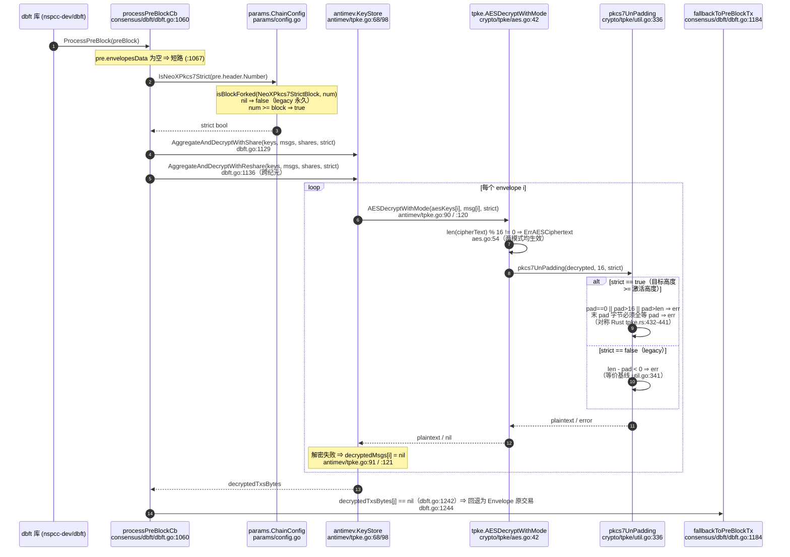
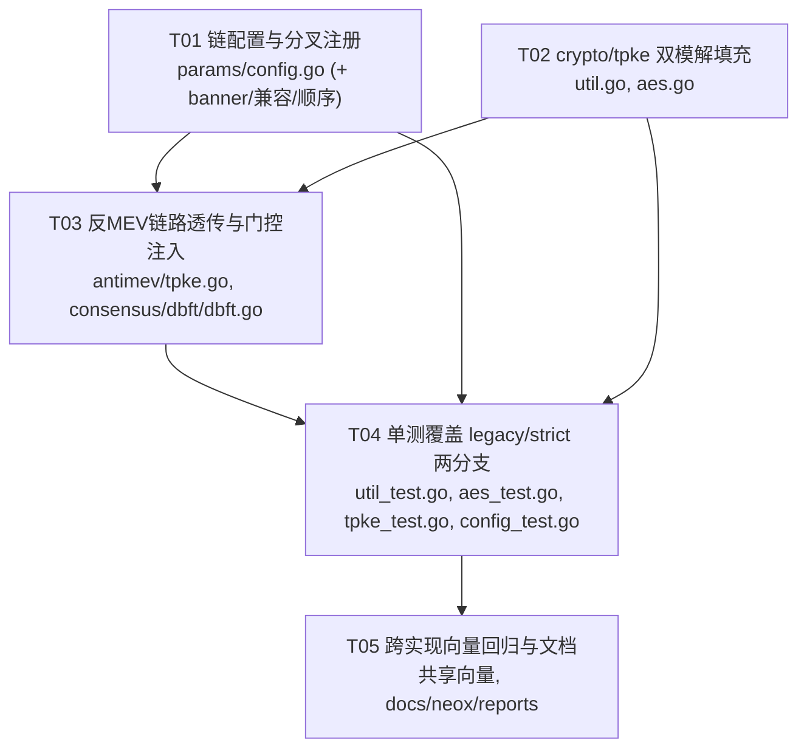

# Neo X Geth：PKCS#7 解填充「按区块高度门控」设计

- 日期：2026-09-09
- 作者：software-architect-3
- 类型：**研究与设计任务（未修改任何代码文件）**
- 关联门禁：**G9 — PKCS#7 strict coordinated activation**（`docs/neox/reports/2026-09-07-VERIFICATION.md:28,77,108`）
- 参考基线：
  - Geth：`D:\Git\neox-geth`，`HEAD = f0e236838bb334c7c0d29eeca33533ed0cfda254`
  - Rust：`D:\Git\neox-rs`，`HEAD = 2da0e8fc9c9a42359a9d13053a9d5cbc7259d22c`
  - 现有补丁工件：`outputs/geth-pkcs7-strict.patch`，sha256 `a2cc2fa368152d15007f89f32d8422b22abdfc2bab1d61696c0dc4e07cb4f281`（+55/-6，**无条件严格化**）

---

## 0. 结论摘要

| 项 | 结论 |
|---|---|
| 门控注入点 | `consensus/dbft/dbft.go:1128`（在 `1129` 行 `AggregateAndDecryptWithShare` 调用之前插入一行 `strict := c.chain.Config().IsNeoXPkcs7Strict(pre.header.Number)`）；配套参数透传 `antimev/tpke.go:90` 与 `antimev/tpke.go:120`，双模实现落在 `crypto/tpke/util.go:336`、`crypto/tpke/aes.go:61` |
| 需要的配置项数量 | **1 个**：可选 genesis 字段 `neoXPkcs7StrictBlock`（`*big.Int`，`omitempty`；缺省/为 `nil` ⇒ 永久 legacy） |
| 是否足以关闭 G9 | **部分足以，但不足以单独关闭。** 本方案消除了 G9 的**技术阻塞项**（无条件严格化导致的「Geth 严格 / Rust 宽松」新分歧），使 G9 从「无安全路径」变为「可安全激活」；但 G9 的关闭还需要 ①两侧二进制同时部署带门控版本 ②治理在两侧同时设定**同一激活高度** ③跨实现向量回归通过。详见 §6 与 §7。 |

**最高风险（必须消除）**：现有 `geth-pkcs7-strict.patch` 把 `pkcs7UnPadding` 无条件改为强校验。若该补丁单独部署到 MainNet/T4（genesis 无 `neoXPkcs7StrictBlock`，Rust 侧 `is_pkcs7_strict_active_at_block` 恒为 `false`），分歧从「双方都宽松」变为「Geth 严格 / Rust 宽松」——与补丁前**同样是共识分歧，且更隐蔽**。本设计通过“按高度选择 legacy/strict”消除该风险。

---

## 1. 证据基线（全部来自实际读取）

### 1.1 Geth 侧

| 事实 | 文件:行 | 证据 |
|---|---|---|
| Neo X 分叉高度字段定义区 | `params/config.go:471-474` | `// Neo X specific forks, enabled after Shanghai but before Cancun, represented in blocks`；三个 `*big.Int` 字段 |
| `NeoXDKGBlock` / `NeoXAMEVBlock` / `NeoXEthSigBlock` | `params/config.go:472-474` | JSON 标签 `neoXDKGBlock,omitempty` 等 |
| Neo X 分叉判定函数 | `params/config.go:857-870` | `IsNeoXDKG`（值接收器）/ `IsNeoXAMEV`、`IsNeoXEthSig`（指针接收器） |
| 分叉顺序注册 | `params/config.go:993-995` | `{name:"neoXDKGBlock", block:..., optional:true}` 等 |
| 兼容性检查注册 | `params/config.go:1149-1157` | `isForkBlockIncompatible(c.NeoXEthSigBlock, newcfg.NeoXEthSigBlock, headNumber)` |
| 启动 banner 注册 | `params/config.go:721-728` | `if c.NeoXEthSigBlock != nil { banner += ... }` |
| 区块分叉判定原语 | `params/config.go:1336-1341` | `isBlockForked(s, head) = (s != nil && head != nil && s.Cmp(head) <= 0)` ⇒ **`head >= s` 即激活** |
| EVM `Rules` 结构 | `params/config.go:1461-1501` | 含 `IsNeoXDKG`；**PKCS#7 门控非 EVM 规则，不需要加入** |
| 调试 tracer 分叉覆盖 | `eth/tracers/api.go:1109-1115` | 已覆盖 `NeoXDKGBlock`/`NeoXAMEVBlock`，**未覆盖 `NeoXEthSigBlock`** |
| MainNet genesis | `config/genesis_mainnet.json:18-20` | `neoXDKGBlock=3623040`、`neoXEthSigBlock=3749760`、`neoXAMEVBlock=3749760`；**无 `neoXPkcs7StrictBlock`** |
| T4 genesis | `config/genesis_testnet.json:18-20` | `neoXDKGBlock=1990080`、`neoXAMEVBlock=2088000`、`neoXEthSigBlock=3750000`；**无 `neoXPkcs7StrictBlock`** |
| 私有网 genesis | `privnet/{single,four,seven,zk}/genesis_privnet.json:19` | `neoXAMEVBlock=0` |
| `ChainConfig` 无自定义 `UnmarshalJSON` | `params/config.go`（全文件检索无匹配） | 标准 `encoding/json` ⇒ **未知字段被静默忽略** |
| dBFT 配置字段 | `params/config.go:499` | `DBFT *DBFTConfig \`json:"dbft,omitempty"\`` |

### 1.2 Rust 侧（对照语义）

| 事实 | 文件:行 | 证据 |
|---|---|---|
| 可选 genesis 字段 | `crates/neox/chainspec/src/config.rs:19-21` | `#[serde(default, rename = "neoXPkcs7StrictBlock", skip_serializing_if = "Option::is_none")] pub pkcs7_strict_block: Option<u64>` |
| 硬分叉枚举 | `crates/neox/chainspec/src/hardfork.rs:16` | `Pkcs7Strict,` |
| 门控函数 | `crates/neox/chainspec/src/spec.rs:61-63` | `is_pkcs7_strict_active_at_block(block_number) = is_fork_active_at_block(Pkcs7Strict, block_number)` |
| 注册为区块分叉 | `crates/neox/chainspec/src/spec.rs:106-108` | `if let Some(b) = neox.pkcs7_strict_block { hardforks.insert(Pkcs7Strict, ForkCondition::Block(b)) }`；**未配置则不插入** |
| 唯一生产调用点 | `crates/neox/node/src/sync/anti_mev.rs:205-208` | `strict = chain_spec().is_pkcs7_strict_active_at_block(verified.block.header().number)` |
| 双模 API | `crates/neox/node/src/antimev.rs:305` | `decrypt_and_validate_with_mode(..., strict: bool)`；`:290` 为 legacy 兼容包装（注释明确 MainNet/T4 省略该字段） |
| 底层实现 | `crates/neox/antimev/src/tpke.rs:401-446` | `:406` 长度/对齐检查**对两种模式均生效**；`:432-441` strict 分支；`:442-443` legacy 分支 |
| 边界语义测试 | `crates/neox/chainspec/src/spec.rs:713-746` | `neoXPkcs7StrictBlock=50` ⇒ `!active(49)`、`active(50)`、`active(100)`；MainNet 在 `1_000_000` 仍 `!active` |
| legacy 必须接受参考客户端行为 | `crates/neox/antimev/tests/geth_negative_vectors.rs:157-171` | `legacy_mode_accepts_reference_client_padding_matrix`：zero/oversized/inconsistent 三种 padding 在 `strict:false` 下**必须成功** |

---

## 2. Neo X Geth 链配置 / 分叉高度存放位置

### 2.1 现状

Neo X 的区块高度分叉**不使用 `params/forks/` 目录**，而是直接以 `*big.Int` 字段形式内联在 `params.ChainConfig` 中，集中在 `params/config.go:471-474`：

```go
// params/config.go:471-474
// Neo X specific forks, enabled after Shanghai but before Cancun, represented in blocks
NeoXDKGBlock    *big.Int `json:"neoXDKGBlock,omitempty"`    // ...
NeoXAMEVBlock   *big.Int `json:"neoXAMEVBlock,omitempty"`   // ...
NeoXEthSigBlock *big.Int `json:"neoXEthSigBlock,omitempty"` // ...
```

一个 Neo X 区块分叉字段要“完整注册”，必须触碰**四个位置**（`params/config.go` 内）：

| # | 位置 | 基线行号 | 作用 | 缺失后果 |
|---|---|---|---|---|
| A | 结构体字段 | `472-474`（在 `474` 之后新增） | JSON 反序列化 + 默认值 | 无法配置 |
| B | 判定函数 `IsNeoX…` | `857-870`（在 `870` 之后新增） | 供共识层调用 | 无法判定 |
| C | `CheckConfigForkOrder` 列表 | `993-995`（在 `995` 之后新增） | 防止分叉顺序“跳变” | 配置错误不被拦截 |
| D | `checkCompatible` 列表 | `1149-1157`（在 `1157` 之后新增） | 已过高度时禁止改配置（**回滚保护**） | 可静默回滚 ⇒ 分叉风险 |

另有**两个可选位置**：

| # | 位置 | 基线行号 | 建议 |
|---|---|---|---|
| E | `Description()` banner | `721-728` | **建议加**（可观测性，避免运维误判节点是否已门控） |
| F | `eth/tracers/api.go` `overrideConfig` | `1109-1115` | **建议加**（P2）。注意现有实现**已遗漏 `NeoXEthSigBlock`**，属既有缺陷；PKCS#7 门控仅影响 `debug_*` tracer 的假想重放，不影响共识 |

**明确不加**：`params/config.go:1461-1501` 的 `Rules`。PKCS#7 门控不是 EVM 规则（不进入 jump table / 预编译），加入会扩大改动面且无收益。

### 2.2 新增字段需要的具体改动

```go
// A. params/config.go:475（紧随 NeoXEthSigBlock 之后）
NeoXPkcs7StrictBlock *big.Int `json:"neoXPkcs7StrictBlock,omitempty"` // Block-based switch to strict PKCS#7 unpadding for Anti-MEV payloads (nil = never, 0 = already activated)

// B. params/config.go:871（紧随 IsNeoXEthSig 之后）
// IsNeoXPkcs7Strict returns whether num is either equal to the NeoXPkcs7Strict fork block or greater.
func (c *ChainConfig) IsNeoXPkcs7Strict(num *big.Int) bool {
    return isBlockForked(c.NeoXPkcs7StrictBlock, num)
}

// C. params/config.go:996（紧随 neoXEthSigBlock 之后）
{name: "neoXPkcs7StrictBlock", block: c.NeoXPkcs7StrictBlock, optional: true},

// D. params/config.go:1158（紧随 NeoXEthSig 检查之后）
if isForkBlockIncompatible(c.NeoXPkcs7StrictBlock, newcfg.NeoXPkcs7StrictBlock, headNumber) {
    return newBlockCompatError("NeoXPkcs7Strict fork block", c.NeoXPkcs7StrictBlock, newcfg.NeoXPkcs7StrictBlock)
}

// E. params/config.go:729（紧随 NeoXEthSig banner 之后）
if c.NeoXPkcs7StrictBlock != nil {
    banner += fmt.Sprintf(" - NeoXPkcs7Strict:            #%-8v\n", c.NeoXPkcs7StrictBlock)
}
```

### 2.3 JSON 反序列化、默认值与 MainNet/T4 兼容性

| 关注点 | 结论 | 依据 |
|---|---|---|
| 反序列化标签 | `json:"neoXPkcs7StrictBlock,omitempty"` —— 与 Rust `#[serde(rename = "neoXPkcs7StrictBlock")]` **逐字一致** | `chainspec/src/config.rs:20` |
| 默认值 | Go：`*big.Int` 零值 `nil`。`isBlockForked(nil, head) == false`（`params/config.go:1337-1339`）⇒ **永久 legacy**。与 Rust `Option<u64>` + `#[serde(default)]` + “未配置就不插入 hardfork”（`spec.rs:106`）**语义等价** | `params/config.go:1336-1341`、`spec.rs:106-108` |
| 再序列化 | `omitempty` 使 `nil` 不写出 ⇒ `geth dumpconfig` 往返不会向 MainNet/T4 genesis 注入该字段 | Go `omitempty` 语义 |
| MainNet/T4 已上线 genesis 不含该字段 | **必须保持不含。** 升级后 `NeoXPkcs7StrictBlock == nil` ⇒ `IsNeoXPkcs7Strict` 恒 `false` ⇒ 走 legacy ⇒ 与未打补丁的参考 Geth **逐字节一致** | `config/genesis_mainnet.json:18-20`、`config/genesis_testnet.json:18-20` |
| 旧二进制读新 genesis | `ChainConfig` 无自定义 `UnmarshalJSON`，未知字段被**静默忽略** ⇒ 旧 Geth 恒 legacy。这是滚动升级期的**分歧源**，必须由部署纪律约束（§6.3） | `params/config.go` 全文件无 `UnmarshalJSON` |

---

## 3. 调用链时序与门控注入点

### 3.1 完整调用链（基线 `f0e23683`）

```
consensus/dbft/dbft.go:1060   processPreBlockCb(b dbft.PreBlock[common.Hash])
  │  注册点：consensus/dbft/dbft.go:391  dbft.WithProcessPreBlock(c.processPreBlockCb)
  │  （仅当 antiMEVEnablingHeight >= 0 时注册，见 dbft.go:385-392）
  ├─ consensus/dbft/dbft.go:1067  len(pre.envelopesData) == 0 短路，不解密
  ├─ consensus/dbft/dbft.go:1092  blockNum = pre.header.Number.Uint64() - 1   ← 父高度，仅用于 DKG 索引
  ├─ consensus/dbft/dbft.go:1129  ks.AggregateAndDecryptWithShare(encryptedKeysCurr, encryptedMsgsCurr, sharesCurr)
  ├─ consensus/dbft/dbft.go:1136  ks.AggregateAndDecryptWithReshare(encryptedKeysPrev, encryptedMsgsPrev, sharesPrev)   ← 跨纪元解密
  │
  ├─> antimev/tpke.go:68   (*KeyStore).AggregateAndDecryptWithShare
  │     └─ antimev/tpke.go:90    m, _ := tpke.AESDecrypt(aesKeys[i], msg[i])
  ├─> antimev/tpke.go:98   (*KeyStore).AggregateAndDecryptWithReshare
  │     └─ antimev/tpke.go:120   raw, _ := tpke.AESDecrypt(aesKeys[i], msg[i])
  │
  └─> crypto/tpke/aes.go:42   AESDecrypt
        ├─ crypto/tpke/aes.go:43   len(cipherText) < 1  → ErrAESCiphertext        （基线已有）
        ├─ crypto/tpke/aes.go:54   len%blockSize != 0   → ErrAESCiphertext        （补丁新增，无条件）
        └─ crypto/tpke/aes.go:61   pkcs7UnPadding(decrypted, blockSize)
              └─ crypto/tpke/util.go:336   pkcs7UnPadding   ← 语义分歧点
```

**唯一性证明**：全仓检索 `pkcs7UnPadding|pkcs7Padding` 仅命中 `crypto/tpke/aes.go:33,61`、`crypto/tpke/util.go:327,336`、`crypto/tpke/util_test.go:38,64`；检索 `AESDecrypt` 的生产调用仅 `antimev/tpke.go:90,120`。`verifyPreBlockCb`（`dbft.go:927-967`）**不做解密**，只做 `VerifyBlock`。因此**解密有且仅有 `dbft.go:1129` / `dbft.go:1136` 两个入口**。

### 3.2 最早可获得「当前区块高度」的位置

| 层级 | 是否可得高度 | 说明 |
|---|---|---|
| `crypto/tpke/util.go:336` / `crypto/tpke/aes.go:42` | ❌ | 纯密码学函数，无链上下文 |
| `antimev/tpke.go:68/98` | ❌ | `KeyStore` 只持有密钥材料，无 `ChainConfig` |
| `consensus/dbft/dbft.go:1060` `processPreBlockCb` | ✅ **最早** | `pre.header.Number`（`*big.Int`，被构建/验证的**目标区块**自身高度）+ `c.chain.Config()`（同一函数内 `:1166`、`:1173`、`:1182` 已取用，零新增依赖） |

> **注意 `dbft.go:1092` 的 `blockNum` 是父高度**（`pre.header.Number.Uint64() - 1`），仅用于 `GetDKGIndex`。**门控不得复用这个变量**——Rust 用的是目标区块自身高度 `verified.block.header().number`（`sync/anti_mev.rs:207`）。误用父高度即构成 **off-by-one 共识分歧**。

### 3.3 门控注入：最小改动方案

在 `consensus/dbft/dbft.go:1128`（`c.lock.RUnlock()` 之后、`:1129` 调用之前）插入**一行**，并把布尔值沿两个调用透传：

```go
// consensus/dbft/dbft.go:1128（新增）
strict := c.chain.Config().IsNeoXPkcs7Strict(pre.header.Number)   // 目标区块自身高度，与 Rust 对齐

// :1129 / :1136 改为
decryptedTxsBytes, err := ks.AggregateAndDecryptWithShare(encryptedKeysCurr, encryptedMsgsCurr, sharesCurr, strict)
...
decryptedTxsBytesPrev, err = ks.AggregateAndDecryptWithReshare(encryptedKeysPrev, encryptedMsgsPrev, sharesPrev, strict)
```

`antimev/tpke.go`：

```go
func (ks *KeyStore) AggregateAndDecryptWithShare(cts []*tpke.CipherText, msg [][]byte,
    inputs map[int]([]*tpke.DecryptionShare), strict bool) ([][]byte, error) {
    ...
    m, _ := tpke.AESDecryptWithMode(aesKeys[i], msg[i], strict)   // :90
}

func (ks *KeyStore) AggregateAndDecryptWithReshare(cts []*tpke.CipherText, msg [][]byte,
    inputs map[int]([]*tpke.DecryptionShare), strict bool) ([][]byte, error) {
    ...
    raw, _ := tpke.AESDecryptWithMode(aesKeys[i], msg[i], strict) // :120
}
```

`crypto/tpke/aes.go`：

```go
// 替换 AESDecrypt；不留隐式默认值的旧签名，避免将来新增调用点悄悄回到 legacy
func AESDecryptWithMode(pg1 *bls12381.G1Affine, cipherText []byte, strict bool) ([]byte, error) {
    if len(cipherText) < 1 { return nil, ErrAESCiphertext }
    seed := pg1.RawBytes()
    hash := sha256.Sum256(seed[0:96])
    block, err := aes.NewCipher(hash[0:32])
    if err != nil { return nil, ErrAESDecryption }
    blockSize := block.BlockSize()
    if len(cipherText)%blockSize != 0 { return nil, ErrAESCiphertext }  // 与 Rust tpke.rs:406 同：两模式均生效
    blockMode := cipher.NewCBCDecrypter(block, hash[:blockSize])
    decrypted := make([]byte, len(cipherText))
    blockMode.CryptBlocks(decrypted, cipherText)
    return pkcs7UnPadding(decrypted, blockSize, strict)                 // :61
}
```

`crypto/tpke/util.go:336`：

```go
func pkcs7UnPadding(data []byte, blockSize int, strict bool) ([]byte, error) {
    length := len(data)
    if length == 0 || blockSize <= 0 {
        return nil, errors.New("invalid pkcs7 padding")
    }
    unPadding := int(data[length-1])
    if strict {
        // 与 crates/neox/antimev/src/tpke.rs:432-441 逐条对应
        if unPadding == 0 || unPadding > blockSize || unPadding > length {
            return nil, errors.New("invalid pkcs7 padding")
        }
        for _, value := range data[length-unPadding:] {
            if int(value) != unPadding {
                return nil, errors.New("invalid pkcs7 padding")
            }
        }
    } else if length-unPadding < 0 {
        // 与基线 crypto/tpke/util.go:341 逐字相同（legacy）
        return nil, errors.New("unpadding failed")
    }
    return data[:(length - unPadding)], nil
}
```

> **为什么删除 `AESDecrypt` 而不是保留 legacy 默认包装**：Rust 侧保留了 `decrypt_and_validate`（legacy 包装，`antimev.rs:290`），但其文档注释明确要求“已知高度时必须用 `with_mode`”；Geth 侧生产调用点只有 2 处且都在门控路径上，保留一个默认 legacy 的旧签名只会制造回退通道。若下游有外部依赖，可保留 `AESDecrypt` 并标注 `// Deprecated: legacy only`，但**生产代码不得调用**。

### 3.4 时序图



---

## 4. 语义对齐说明（Rust ⇄ Geth）

### 4.1 门控比较语义

| 侧 | 判定 | 等价形式 |
|---|---|---|
| Rust | `is_fork_active_at_block(Pkcs7Strict, n)`，`ForkCondition::Block(b)` | `n >= b` |
| Geth | `isBlockForked(c.NeoXPkcs7StrictBlock, num)`（`params/config.go:1336-1341`） | `s.Cmp(head) <= 0` ⇒ `head >= s` |

**两侧必须使用完全一致的比较语义**：`目标区块高度 >= 激活高度 ⇒ strict`。

### 4.2 高度取值（off-by-one 高发点）

| 侧 | 取值 | 文件:行 |
|---|---|---|
| Rust | `verified.block.header().number` —— **被重建区块自身高度** | `crates/neox/node/src/sync/anti_mev.rs:207` |
| Geth | `pre.header.Number` —— **被构建/验证区块自身高度** | `consensus/dbft/dbft.go:1128`（新增） |

**禁止**使用以下任何替代值：

| 错值 | 位置 | 后果 |
|---|---|---|
| `pre.header.Number - 1` | `dbft.go:1092` 的 `blockNum` | **off-by-one**：Geth 比 Rust 晚一个区块进入 strict ⇒ 激活高度处出现单块分歧 |
| `pre.header.Number + 1` | — | **off-by-one**：Geth 早一个区块进入 strict ⇒ 同上 |
| `c.chain.CurrentBlock().Number` | 链头 | 受本地同步进度影响 ⇒ 非确定性 |
| `ctx.BlockIndex` | `dbft.go:545` | 共识轮内索引，语义不同 |

### 4.3 解填充边界条件逐条对齐

| 输入特征 | Rust strict（`tpke.rs:432-441`） | Geth strict（本设计） | Rust legacy（`tpke.rs:442-443`） | Geth legacy（本设计，= 基线 `util.go:341`） |
|---|---|---|---|---|
| 密文为空 | `Err`（`:406`，先于模式判断） | `Err`（`aes.go:43`） | `Err`（`:406`） | `Err`（`aes.go:43`，基线已有） |
| 密文长度非 16 倍数 | `Err`（`:406`） | `Err`（`aes.go:54`） | `Err`（`:406`） | `Err`（`aes.go:54`，**补丁新增**） |
| `pad == 0` | `Err` | `Err` | **接受**，截 0 字节 | **接受**，截 0 字节 |
| `pad > 16`（如 20） | `Err` | `Err` | **接受**（若 `len >= pad`），截 `pad` 字节 | **接受**（若 `len >= pad`），截 `pad` 字节 |
| `pad > len` | `Err` | `Err` | `Err` | `Err` |
| 末 `pad` 字节不全等于 `pad` | `Err` | `Err` | **接受** | **接受** |
| `1 <= pad <= 16` 且字节一致 | 截 `pad` 字节 | 截 `pad` 字节 | 截 `pad` 字节 | 截 `pad` 字节 |

证明来源：Rust `crates/neox/antimev/src/tpke.rs:401-446`；legacy 必须接受 zero/oversized/inconsistent 由 `crates/neox/antimev/tests/geth_negative_vectors.rs:157-171` 锁定；Geth 基线 legacy 由 `git show HEAD:crypto/tpke/util.go`（`pkcs7UnPadding`，第 336-346 行）确认。

### 4.4 「密文长度非 16 倍数」这一项的特别说明

- Rust：`:406` 位于模式分支**之前**，对 legacy 与 strict **同等生效**。
- Geth 基线：**无**此检查；非对齐密文会带着垃圾明文进入 `pkcs7UnPadding`，绝大多数情况下 `length-unPadding >= 0` 成立，返回一个垃圾切片。
- 因此补丁在 `aes.go:54` 加的检查**使 Geth 更贴近 Rust**，而不是相反。
- 但仍需显式验证：基线下该垃圾切片随后在 `dbft.go:1255` `decryptedTx.UnmarshalBinary` 失败 ⇒ `fallbackToPreBlockTx`（`:1256`）。**两条路径都落到 Envelope 回退**，故主网上行为不可观测地相同。本设计把这一条列为 T04 的必测回归（§7），而非默认其等价。

### 4.5 其他必须一致的点

| 项 | Rust | Geth | 状态 |
|---|---|---|---|
| 分叉类型 | `ForkCondition::Block`（按高度） | `*big.Int` 区块分叉 | ✅ 一致；**不得**用 `Timestamp` |
| 未配置时 | 不插入 hardfork ⇒ 恒 false | `nil` ⇒ `isBlockForked` 恒 false | ✅ 一致 |
| `0` 值含义 | 已激活（genesis 起 strict） | 已激活（`0 <= num` 恒真） | ✅ 一致 |
| 是否附加 `IsLondon` 等前件 | **无** | 本设计**不加** | 刻意对称：`IsNeoXAMEV`/`IsNeoXEthSig` 带 `IsLondon` 前件（`config.go:863,868`），但 Rust 的 `is_pkcs7_strict_active_at_block` 无前件。加前件会在 London=0 的链上等价、在其它配置下**不对称** |
| 跨纪元（上一轮 DKG）密文 | 同一 `strict` 值（`antimev.rs:305` 单参数贯穿两个 epoch） | 同一 `strict` 值（`dbft.go:1129,1136` 共用） | ✅ 必须共用同一变量 |
| 判定失败后的处理 | `AntiMevEnvelopeResolution::Fallback` | `decryptedMsgs[i] = nil` ⇒ `fallbackToPreBlockTx` | ✅ 语义等价（回退为 Envelope 原交易） |

---

## 5. 风险登记

| ID | 风险 | 等级 | 触发条件 | 缓解 |
|---|---|---|---|---|
| R1 | **无条件严格化分歧**（当前最高） | 🔴 高 | 现有 `geth-pkcs7-strict.patch` 单独部署，Rust 链未配置激活高度 | 本设计：改为按高度选择；未配置 ⇒ 恒 legacy |
| R2 | off-by-one 高度分歧 | 🔴 高 | 误用 `dbft.go:1092` 的父高度 `blockNum` | 只用 `pre.header.Number`；T04 加边界单测 |
| R3 | 单侧激活 | 🔴 高 | 只改 Geth genesis 或只改 Rust genesis | 两侧**同一高度**、同一次治理变更；`neoXPkcs7StrictBlock` 字段名与 JSON 标签逐字一致（§2.3） |
| R4 | 旧二进制 + 新 genesis | 🟠 中 | 运维更新 genesis 但未升级二进制（未知字段被静默忽略） | 部署纪律：先全量升级二进制，**再**设定高度；banner（E 项）用于核验 |
| R5 | `aes.go:54` 对齐检查改变 legacy 行为 | 🟡 低 | 非 16 倍数密文 | 理论等价（§4.4）；T04 必测 |
| R6 | 分叉顺序约束过严 | 🟡 低 | 激活高度 < `neoXEthSigBlock` 时 `CheckConfigForkOrder` 报错（因插在 `:995` 之后） | 可接受且是期望行为（PKCS#7 只在 Anti-MEV 之后有意义）；若需解耦则须改放列表位置——**不推荐** |
| R7 | `eth/tracers/api.go` 未覆盖 | 🟢 极低 | `debug_traceBlock` 带 fork override | 建议补（F 项）；不影响共识 |
| R8 | 回滚 | 🔴 高 | 激活后回退二进制或 genesis | 见 §6.3 纪律 |

---

## 6. 兼容性与升级/回滚纪律

### 6.1 未配置字段时必须等价于 legacy

- `NeoXPkcs7StrictBlock == nil` ⇒ `isBlockForked` 返回 `false`（`params/config.go:1337-1339`）⇒ `strict == false` ⇒ `pkcs7UnPadding` 走 `else if length-unPadding < 0` 分支…
- …该分支与基线 `crypto/tpke/util.go:336-346` 的 `pkcs7UnPadding` **逻辑逐字相同**。
- ⇒ MainNet / T4 / 所有 `genesis_privnet.json` 升级后**行为零变化**，与未打补丁的参考 Geth 字节兼容。
- 唯一残留差异：`aes.go:54` 的对齐检查（R5，§4.4）。若要求 100% 严格等价，可将其也纳入 `strict` 门控——**不推荐**，因为那会与 Rust（无条件检查，`tpke.rs:406`）产生新的不对称。

### 6.2 已上线 genesis 的处置

| 网络 | genesis 文件 | 动作 |
|---|---|---|
| MainNet | `config/genesis_mainnet.json` | **不修改**（保持无 `neoXPkcs7StrictBlock`）|
| T4 | `config/genesis_testnet.json` | **不修改** |
| privnet | `privnet/*/genesis_privnet.json` | 可选：设为 `0` 用于 strict 路径的本地演练 |
| 未来新链 | — | 直接设为 `0`（genesis 起 strict），需在两侧同时生效 |

### 6.3 升级 / 回滚纪律（强制）

1. **顺序**：① 全量部署带门控的 Geth 与 Rust 二进制 → ② 观察（banner 显示 `NeoXPkcs7Strict` 未激活）→ ③ 治理在两侧 genesis 中设定**同一** `neoXPkcs7StrictBlock` 高度 H → ④ 到达 H 后双方同时 strict。
2. **激活高度 H 必须选在未来**，且留出至少一个完整 epoch 的观察窗口；H 不得等于或早于任何节点可能的链头。
3. **禁止 strict/legacy 混跑**：一旦有任何节点在高度 ≥ H 走 strict，其余节点必须同样走 strict。混跑直接导致 Envelope 是否被解密的分歧 ⇒ 区块重组/共识失败。
4. **禁止 ad-hoc rollback**：激活后禁止通过删除/下调 `neoXPkcs7StrictBlock` 或回退二进制来“取消”strict。此操作在 `CheckCompatible`（`params/config.go:1158` 新增项）处会被拦截并触发 rewind，但**不得依赖该拦截作为回滚手段**——它只会把节点带到需要人工重同步的状态。
5. **唯一受控回滚路径**：若激活后发现问题，只能在同一高度 H 上通过**新的协调硬分叉**（提高 H 或引入新的规范化字段）修复，且必须在两侧同步执行。
6. **审计留痕**：激活前后分别记录 `geth dump-config`/启动 banner 与 Rust 侧 `is_pkcs7_strict_active_at_block(H-1)/…(H)` 的输出。

---

## 7. 有序任务列表

### 7.1 依赖图



### 7.2 任务清单

#### T01 — 链配置与分叉注册（P0）

- **依赖**：无
- **文件**：
  - `params/config.go`（新增字段 `:475`、判定函数 `:871`、顺序检查 `:996`、兼容检查 `:1158`、banner `:729`；**不**改 `Rules` `:1461`）
  - `params/config_test.go`（新增分叉判定与兼容性用例）
  - `config/genesis_mainnet.json`（**只读校验**：确认无 `neoXPkcs7StrictBlock`）
  - `config/genesis_testnet.json`（**只读校验**）
- **验证**：
  - `go test ./params/ -run NeoX -v`
  - 新增用例：`NeoXPkcs7StrictBlock=nil` ⇒ 任意高度 `IsNeoXPkcs7Strict == false`；`=50` ⇒ `(49)==false, (50)==true, (100)==true`（与 `spec.rs:713-746` 逐项镜像）；`=0` ⇒ 恒 true
  - `geth dumpconfig` 对 MainNet genesis 的往返输出**不含** `neoXPkcs7StrictBlock`

#### T02 — `crypto/tpke` 双模解填充（P0）

- **依赖**：无
- **文件**：`crypto/tpke/util.go`（`:336` 改签名为 `pkcs7UnPadding(data []byte, blockSize int, strict bool)`）、`crypto/tpke/aes.go`（`:42` 改 `AESDecrypt` → `AESDecryptWithMode`）
- **验证**：
  - `go build ./crypto/tpke/`
  - legacy 分支必须对 zero / oversized / inconsistent 三种 padding **返回成功**（`geth_negative_vectors.rs:157-171` 的 Go 镜像）
  - strict 分支必须对同样三种输入 **返回错误**

#### T03 — 反 MEV 链路透传与门控注入（P0）

- **依赖**：T01、T02
- **文件**：
  - `antimev/tpke.go`（`:68`、`:98` 增加 `strict bool` 形参；`:90`、`:120` 改调 `AESDecryptWithMode`）
  - `consensus/dbft/dbft.go`（`:1128` 新增 `strict := c.chain.Config().IsNeoXPkcs7Strict(pre.header.Number)`；`:1129`、`:1136` 透传）
  - `eth/tracers/api.go`（`:1115` 后补 `NeoXPkcs7StrictBlock` override，P2）
  - `crypto/tpke/aes_test.go`（`:21` 调用点改签名）
- **验证**：
  - `go build ./...`
  - `go test ./antimev/... ./consensus/dbft/... -run AntiMev -v`（现有 `antimev/tpke_test.go:106,190,340` 三个调用点补齐 `strict` 实参后必须全绿，且 `strict=false` 下结果与基线一致）
  - 静态检查：`git grep -n "AESDecrypt(" ` 不得再有生产调用命中旧签名

#### T04 — 单测覆盖 legacy/strict 两分支（P0）

- **依赖**：T02、T03
- **文件**：`crypto/tpke/util_test.go`、`crypto/tpke/aes_test.go`、`antimev/tpke_test.go`、`params/config_test.go`
- **必须的用例矩阵**：

| 用例 | strict=false 期望 | strict=true 期望 |
|---|---|---|
| `pad ∈ [1,16]` 且字节一致 | 成功，截 `pad` | 成功，截 `pad`（**同值**） |
| `pad == 0`（全 0 块） | **成功** | Err |
| `pad == 17`（oversized） | **成功**（len=32 时截 17） | Err |
| `pad == 255` | Err（len < pad） | Err |
| 末 `pad` 字节不一致 | **成功** | Err |
| 长度非 16 倍数 | Err（两模式） | Err（两模式） |
| 空输入 | Err（两模式） | Err（两模式） |
| `IsNeoXPkcs7Strict`：nil / H-1 / H / H+1 | — | false / false / **true** / true（H=50 场景） |

- **验证**：`go test ./crypto/tpke/... ./antimev/... ./params/... -count=1`
- **关键回归**：对上面「legacy 必须成功」的三行，用 `git stash` 切回基线 `f0e23683` 跑同向量，断言与基线 Geth **输出逐字节相同**（这是 MainNet 兼容性的直接证明）。

#### T05 — 跨实现向量回归与文档（P1）

- **依赖**：T04
- **文件**：
  - 与 Rust 共享的负向量（对齐 `crates/neox/antimev/tests/geth_negative_vectors.rs` 的 `PKCS7_ZERO_PADDING` / `PKCS7_OVERSIZED_PADDING` / `PKCS7_INCONSISTENT_PADDING` / `PKCS7_VALID` 十六进制常量）
  - `docs/neox/reports/`（本文 + 激活 runbook）
- **验证**：
  - 两侧对同一常量集合在 `strict=false` / `strict=true` 下给出**相同 accept/reject 判定**
  - 生成新的 `outputs/geth-pkcs7-strict-height-gate.patch` 并记录 sha256（**取代** `a2cc2fa3…` 的无条件版本，或明确标注其作废）
  - 更新 `2026-09-07-VERIFICATION.md:77` 的 G9 状态行

---

## 8. 共享知识（给 Engineer 的硬性约束）

1. 判定语义唯一来源：`params/config.go:1336-1341` 的 `isBlockForked`，即 `激活高度 <= 区块高度` ⇒ 激活。**不得自行实现比较**。
2. 高度唯一来源：`processPreBlockCb` 中的 `pre.header.Number`（目标区块自身高度）。`dbft.go:1092` 的 `blockNum` 是父高度，**禁止**用于本门控。
3. 一次共识轮内 `strict` 必须是一个常量：`dbft.go:1129` 与 `:1136`（当前轮 / 上一轮 DKG）**共用同一变量**。
4. `crypto/tpke` 不得 import `params`（会形成 `params → crypto` 方向之外的循环风险且破坏包边界）；模式必须由上层以 `bool` 注入。
5. legacy 分支的判定条件必须保持为 `length-unPadding < 0`，**不要**“顺手”加 `unPadding > blockSize` 之类检查——那会破坏 MainNet 兼容。
6. JSON 标签必须逐字为 `neoXPkcs7StrictBlock`，与 `crates/neox/chainspec/src/config.rs:20` 一致。
7. 解密失败 `= nil` → `fallbackToPreBlockTx`（`dbft.go:1244-1248`）。**任何**新增的 reject 条件都只是在“解密成功/回退”之间切换，会直接改变区块内容，故必须有显式测试。
8. `config/genesis_mainnet.json` 与 `config/genesis_testnet.json` 在本方案中**不得被修改**。

---

## 9. Anything UNCLEAR / 假设

| # | 问题 | 假设 / 需要确认 |
|---|---|---|
| U1 | G9 的正式关闭判据是否包含“跨实现向量回归通过” | 本文按 `2026-09-07-VERIFICATION.md:28`（“Both clients patched + activation height set”）理解，额外要求向量回归。需 team-lead 确认判据口径 |
| U2 | 激活高度 H 的选取与治理流程 | 本文只规定“两侧同一 H、在未来、留观察窗口”，不指定具体 H。需治理输入 |
| U3 | `ForkCondition::Block(n)` 在所用 reth 版本中是否为 `block_number >= n` | 依据 `crates/neox/chainspec/src/spec.rs:741-743` 的单测断言（49 false / 50 true / 100 true）确认为 `>=`；未直接阅读 reth `ForkCondition` 源码 |
| U4 | 是否存在除 `sync/anti_mev.rs:207` 以外的 Rust 解密路径（如 RPC/回溯） | 全仓检索 `is_pkcs7_strict_active_at_block` 仅命中 `spec.rs:61` 与定义处、`sync/anti_mev.rs:207`；`decrypt_and_validate`（legacy 包装，`antimev.rs:290`）存在但文档标注生产同步不走。需 team-lead 确认无其它生产调用者 |
| U5 | `IsNeoXPkcs7Strict` 是否需带 `IsLondon` / `IsNeoXAMEV` 前件 | 本文选择**不带**（与 Rust 严格对称）。若治理要求“仅在 Anti-MEV 激活后才可能 strict”，可加 `c.IsNeoXAMEV(num) &&`，但须同步在 Rust 侧加等价前件，否则不对称 |
| U6 | privnet genesis 是否要预置 `neoXPkcs7StrictBlock: 0` | 本文列为可选。若要演练 strict 路径则建议设 `0`，但需两侧私网同时配置 |
| U7 | 旧 `outputs/geth-pkcs7-strict.patch`（sha256 `a2cc2fa3…`）的处置 | 本文建议**作废并重新生成**带门控版本；若需保留作为历史工件，必须在其头部加醒目作废声明 |

---

## 10. 附：关键行号速查

| 用途 | 位置 |
|---|---|
| **门控注入点（新增行）** | `consensus/dbft/dbft.go:1128` |
| 门控透传点 1 | `consensus/dbft/dbft.go:1129` |
| 门控透传点 2 | `consensus/dbft/dbft.go:1136` |
| 反 MEV 解密包装 | `antimev/tpke.go:68` / `:98`；AES 调用 `:90` / `:120` |
| AES 解密 | `crypto/tpke/aes.go:42`；对齐检查 `:54`；解填充调用 `:61` |
| 解填充实现 | `crypto/tpke/util.go:336`（基线 `336-346`） |
| 新增配置字段 | `params/config.go:475`（区 `471-474`） |
| 新增判定函数 | `params/config.go:871`（区 `857-870`） |
| 顺序检查 | `params/config.go:996`（区 `993-995`） |
| 兼容检查 | `params/config.go:1158`（区 `1149-1157`） |
| banner | `params/config.go:729`（区 `721-728`） |
| 分叉判定原语 | `params/config.go:1336-1341` |
| Rust 门控 | `crates/neox/chainspec/src/spec.rs:61-63`；调用 `crates/neox/node/src/sync/anti_mev.rs:207` |
| Rust 双模实现 | `crates/neox/antimev/src/tpke.rs:401-446` |
